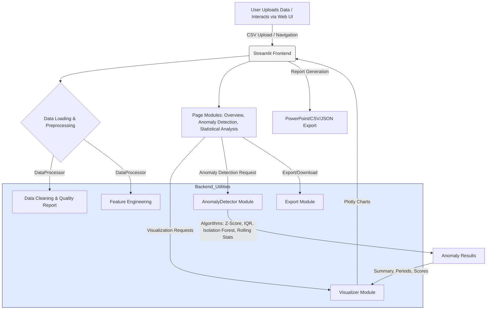

# 🌪️ Cyclone Preheater Anomaly Detection

[](https://cyclone-preheater-anomaly-detection.streamlit.app/)
[](LICENSE)

A high-performance, interactive analytics dashboard for **anomaly detection in cyclone preheater systems**. Analyze large-scale industrial time-series data, apply multiple detection algorithms, visualize insights, and generate automated reports—all from a user-friendly web app.

---

## 🚀 Live Demo

**Try it online:**  
[https://cyclone-preheater-anomaly-detection.streamlit.app/](https://cyclone-preheater-anomaly-detection.streamlit.app/)

---

## 🏗️ System Architecture



## 📝 Features

- **Data Overview & Quality Assessment**  
  - Interactive summary statistics, missing values, and data types
  - Correlation analysis and heatmaps

- **Anomaly Detection**
  - Multiple methods: Z-Score, IQR, Isolation Forest, Rolling Statistical
  - Combine and compare detection results
  - Detect anomaly periods and compute severity

- **Statistical Analysis**
  - Advanced correlation (Pearson, Spearman, Kendall)
  - Normality and stationarity tests
  - Time series decomposition, trend analysis, and variable relationships

- **Interactive Visualizations**
  - Time series, distribution, scatter, and 3D multivariate anomaly plots (Plotly)
  - Anomaly period timelines and method comparisons

- **Performance Optimized**
  - Handles large datasets (tested on 370K+ rows)
  - Sampling options for speed

- **Automated Export**
  - Download results as CSV, JSON, or PowerPoint reports

---

## 📂 Directory Structure

```
Cyclone-Preheater-Anomaly-Detection/
│
├── app.py                   # Main Streamlit app entrypoint
├── data/
│   └── data.csv             # Example dataset
├── pages/
│   ├── 1_Data_Overview.py
│   ├── 2_Anomaly_Detection.py
│   └── 3_Statistical_Analysis.py
├── utils/
│   ├── data_processor.py
│   ├── anomaly_detector.py
│   └── visualizer.py
├── .streamlit/
│   └── config.toml
├── .vscode/
│   └── launch.json
└── README.md
```

---

## 📊 Expected Data Format

- **CSV with at least:**
  - `time` column (timestamps)
  - Sensor variables (e.g., temperatures, pressures, drafts)
  - Regular intervals (e.g., 5 minutes)

Example:

| time               | Cyclone_Inlet_Gas_Temp | Cyclone_Material_Temp | ... |
|--------------------|-----------------------|-----------------------|-----|
| 1/1/2017 0:00      | 867.63                | 910.42                | ... |
| 1/1/2017 0:05      | 879.23                | 918.14                | ... |

---

## 🛠️ Getting Started (Local)

1. **Clone the repo**
    ```bash
    git clone https://github.com/HarshMishra-Git/Cyclone-Preheater-Anomaly-Detection.git
    cd Cyclone-Preheater-Anomaly-Detection
    ```
2. **Install dependencies**
    ```bash
    pip install -r requirements.txt
    ```
3. **Run locally**
    ```bash
    streamlit run app.py
    ```
4. **Open in browser:**  
   Visit [http://localhost:8501](http://localhost:8501)

---

## 📦 Requirements

- Python 3.8+
- [Streamlit](https://streamlit.io/)
- pandas, numpy, scikit-learn, plotly, statsmodels, scipy, etc.

Install all with:
```bash
pip install -r requirements.txt
```

---

## 📑 Usage

- Launch the app locally or use the [hosted version](https://cyclone-preheater-anomaly-detection.streamlit.app/)
- Upload your cyclone preheater sensor CSV, or use the sample dataset
- Use the sidebar to navigate:
    - **Data Overview**: Explore & assess dataset
    - **Anomaly Detection**: Run, visualize & export anomaly results
    - **Statistical Analysis**: Deep-dive into stats, normality, trends, etc.
- Download results and reports for further analysis

---

## 📸 Screenshots

<details>
<summary>Dashboard Overview</summary>


</details>

<details>
<summary>Anomaly Detection</summary>


</details>

---

## 🤖 Authors

- [Harsh Mishra](https://github.com/HarshMishra-Git)

---

## 📄 License

This project is licensed under the [MIT License](LICENSE).

---

## 🌐 Links

- **Deployed App:** [https://cyclone-preheater-anomaly-detection.streamlit.app/](https://cyclone-preheater-anomaly-detection.streamlit.app/)
- **GitHub Repo:** [https://github.com/HarshMishra-Git/Cyclone-Preheater-Anomaly-Detection](https://github.com/HarshMishra-Git/Cyclone-Preheater-Anomaly-Detection)

---
